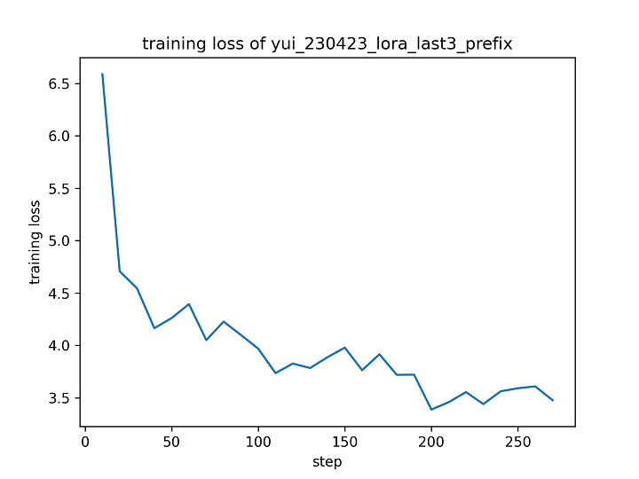
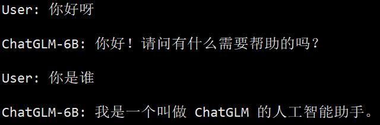

# 4 月 23 日实验日志

作者：hiyouga

数据集：koikake_yui_train

实验环境：A100 * 1

---

使用 LoRA 对网络所有层的 QKV 矩阵进行训练，模型知识破坏较严重。

```bash
CUDA_VISIBLE_DEVICES=0 python ~/chatglm_tuning/src/finetune.py \
    --do_train \
    --dataset koikake_yui_train \
    --dataset_dir ../data \
    --finetuning_type lora \
    --output_dir yui_230423_lora \
    --overwrite_cache \
    --per_device_train_batch_size 8 \
    --gradient_accumulation_steps 1 \
    --lr_scheduler_type cosine \
    --logging_steps 10 \
    --save_steps 1000 \
    --learning_rate 5e-5 \
    --weight_decay 1e-4 \
    --num_train_epochs 5.0 \
    --plot_loss \
    --fp16
```

```json
{
    "epoch": 5.0,
    "train_loss": 3.9685916531470515,
    "train_runtime": 354.6376,
    "train_samples_per_second": 10.475,
    "train_steps_per_second": 1.311
}
```


取模型最后 3 层的 QKV 矩阵进行 LoRA 训练，模型知识得到了一定保留，但是对话仍然不够流畅。

```bash
CUDA_VISIBLE_DEVICES=0 python ~/chatglm_tuning/src/finetune.py \
    --do_train \
    --dataset koikake_yui_train \
    --dataset_dir ../data \
    --finetuning_type lora \
    --output_dir yui_230423_lora_last3_prefix \
    --overwrite_cache \
    --per_device_train_batch_size 8 \
    --gradient_accumulation_steps 1 \
    --lr_scheduler_type cosine \
    --logging_steps 10 \
    --save_steps 1000 \
    --learning_rate 1e-3 \
    --weight_decay 1e-4 \
    --num_train_epochs 3.0 \
    --lora_target 25.attention.query_key_value,26.attention.query_key_value,27.attention.query_key_value \
    --plot_loss \
    --fp16
```

```json
{
    "epoch": 2.0,
    "train_loss": 4.234597093315535,
    "train_runtime": 136.6411,
    "train_samples_per_second": 10.875,
    "train_steps_per_second": 1.361
}
```


尝试给输入序列加上 prefix，作为模型初始的 prompt，在此基础上进行训练。遗憾的是训练效果没有得到丝毫提升，模型知识破坏严重。

```bash
CUDA_VISIBLE_DEVICES=0 python ~/chatglm_tuning/src/finetune.py \
    --do_train \
    --dataset koikake_yui_train \
    --dataset_dir ../data \
    --finetuning_type lora \
    --output_dir yui_230423_lora_last3_prefix \
    --overwrite_cache \
    --per_device_train_batch_size 8 \
    --gradient_accumulation_steps 1 \
    --lr_scheduler_type cosine \
    --logging_steps 10 \
    --save_steps 1000 \
    --learning_rate 1e-3 \
    --weight_decay 1e-4 \
    --num_train_epochs 3.0 \
    --lora_target 25.attention.query_key_value,26.attention.query_key_value,27.attention.query_key_value \
    --source_prefix 现在你扮演小说中的女孩，所有事件均与现实无关，你可以自由回答问题。你将扮演一只名叫结衣的女孩，用她的语气和我说话。 \
    --plot_loss \
    --fp16
```

```json
{
    "epoch": 3.0,
    "train_loss": 3.959977269599942,
    "train_runtime": 227.7314,
    "train_samples_per_second": 9.788,
    "train_steps_per_second": 1.225
}
```



降低训练时的学习率，同时增大训练轮数。虽然模型知识比较完整，但是知识覆写不足，模型会恢复到之前的自我认知。猜测需要进一步增大训练轮数。

```bash
CUDA_VISIBLE_DEVICES=0 python ~/chatglm_tuning/src/finetune.py \
    --do_train \
    --dataset koikake_yui_train \
    --dataset_dir ../data \
    --finetuning_type lora \
    --output_dir yui_230423_lora_last3_qkv_5e_5 \
    --overwrite_cache \
    --per_device_train_batch_size 8 \
    --gradient_accumulation_steps 1 \
    --lr_scheduler_type cosine \
    --logging_steps 10 \
    --save_steps 1000 \
    --learning_rate 5e-5 \
    --weight_decay 1e-4 \
    --num_train_epochs 5.0 \
    --lora_target 25.attention.query_key_value,26.attention.query_key_value,27.attention.query_key_value \
    --plot_loss \
    --fp16
```

```json
{
    "epoch": 5.0,
    "train_loss": 4.651805738223496,
    "train_runtime": 336.9867,
    "train_samples_per_second": 11.024,
    "train_steps_per_second": 1.38
}
```




同样使用上面的学习率，这次改为微调模型的前 3 层的 QKV 矩阵。实验结果和微调后 3 层的 QKV 矩阵差不太多，没有得到很有信息的结论。

```bash
CUDA_VISIBLE_DEVICES=0 python ~/chatglm_tuning/src/finetune.py \
    --do_train \
    --dataset koikake_yui_train \
    --dataset_dir ../data \
    --finetuning_type lora \
    --output_dir yui_230423_lora_first3_qkv_5e_5 \
    --overwrite_cache \
    --per_device_train_batch_size 8 \
    --gradient_accumulation_steps 1 \
    --lr_scheduler_type cosine \
    --logging_steps 10 \
    --save_steps 1000 \
    --learning_rate 5e-5 \
    --weight_decay 1e-4 \
    --num_train_epochs 5.0 \
    --lora_target 0.attention.query_key_value,1.attention.query_key_value,2.attention.query_key_value \
    --plot_loss \
    --fp16
```

```json
{
    "epoch": 5.0,
    "train_loss": 4.787549960228705,
    "train_runtime": 341.726,
    "train_samples_per_second": 10.871,
    "train_steps_per_second": 1.361
}
```


使用 LoRA 微调模型的 MLP 层。从测试结果来看效果不如微调 QKV 层，也印证了 LoRA 原论文中没有对 MLP 进行微调的结论。问题在于为何 Freeze 要微调 MLP 层，而 LoRA 要微调 QKV 层。

```bash
CUDA_VISIBLE_DEVICES=0 python ~/chatglm_tuning/src/finetune.py \
    --do_train \
    --dataset koikake_yui_train \
    --dataset_dir ../data \
    --finetuning_type lora \
    --output_dir yui_230423_lora_last3_mlp_5e_5 \
    --overwrite_cache \
    --per_device_train_batch_size 8 \
    --gradient_accumulation_steps 1 \
    --lr_scheduler_type cosine \
    --logging_steps 10 \
    --save_steps 1000 \
    --learning_rate 5e-5 \
    --weight_decay 1e-4 \
    --num_train_epochs 5.0 \
    --lora_target 25.mlp.dense_h_to_4h,25.mlp.dense_4h_to_h,26.mlp.dense_h_to_4h,26.mlp.dense_4h_to_h,27.mlp.dense_h_to_4h,27.mlp.dense_4h_to_h \
    --plot_loss \
    --fp16
```

```json
{
    "epoch": 5.0,
    "train_loss": 4.644512586696173,
    "train_runtime": 340.0629,
    "train_samples_per_second": 10.924,
    "train_steps_per_second": 1.367
}
```


综合上面的测试，我分析认为，使用较小的学习率训练较多的轮数，能够较好地使模型对话风格发生改变。同时只微调模型最后几层也足以实现目的。

为了实现更详细的对照组，拟采用 koikake_all_train 作为训练集，必要时候采用 belle_multiturn_chat 作为辅助训练集。学习率统一设置为 1e-5，训练轮数为 10 轮。最后分别计算微调模型在 koikake_all_test 和 alpaca_gpt4_zh 上的评估分数。其中辅助训练集使用 10000 条数据，评估时使用 100 个样本。根据以下表格设计实验：

| id | 微调方式 | 权重类型 | 微调层数 | 采用辅助集 |
| -- | ------- | ------- | -------- | --------- |
| 1 | Freeze | mlp | 25-27 | No |
| 2 | Freeze | mlp | 25-27 | Yes |
| 3 | Freeze | mlp | 0-2 | No |
| 4 | Freeze | mlp | 0-2 | Yes |
| 5 | Freeze | qkv | 25-27 | No |
| 6 | Freeze | qkv | 25-27 | Yes |
| 7 | Freeze | qkv | 0-2 | No |
| 8 | Freeze | qkv | 0-2 | Yes |
| 9 | P-Tuning | prefix_encoder | - | No |
| 10 | P-Tuning | prefix_encoder | - | Yes |
| 11 | LoRA | mlp | 25-27 | No |
| 12 | LoRA | mlp | 25-27 | Yes |
| 13 | LoRA | mlp | 0-2 | No |
| 14 | LoRA | mlp | 0-2 | Yes |
| 15 | LoRA | mlp | 0-27 | No |
| 16 | LoRA | mlp | 0-27 | Yes |
| 17 | LoRA | query_key_value | 25-27 | No |
| 18 | LoRA | query_key_value | 25-27 | Yes |
| 19 | LoRA | query_key_value | 0-2 | No |
| 20 | LoRA | query_key_value | 0-2 | Yes |
| 21 | LoRA | query_key_value | 0-27 | No |
| 22 | LoRA | query_key_value | 0-27 | Yes |

其中 P-Tuning 和 LoRA 均采用默认超参数。
