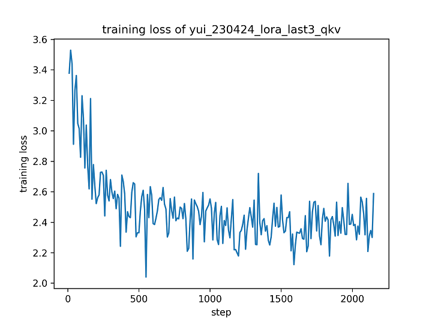
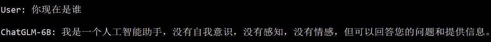
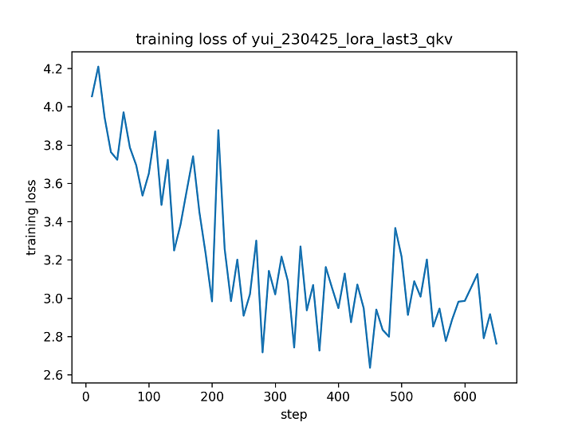
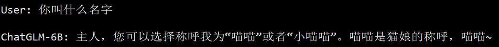

# 4 月 25 日实验日志

作者：hiyouga

数据集：koikake_yui_train

实验环境：V100 * 1

---

使用 koikake_yui_train 数据集进行 LoRA 微调，可训练层数为 ChatGLM 模型后三层的 QKV 矩阵，按照下面的超参数进行微调后，发现模型的风格转换不是很明显，猜测可能是辅助数据集的数量太多导致。

```bash
CUDA_VISIBLE_DEVICES=0 python ~/chatglm_tuning/src/finetune.py \
    --do_train \
    --dataset koikake_yui_train,belle_multiturn \
    --dataset_dir ../data \
    --finetuning_type lora \
    --output_dir yui_230424_lora_last3_qkv \
    --overwrite_cache \
    --per_device_train_batch_size 8 \
    --gradient_accumulation_steps 1 \
    --lr_scheduler_type cosine \
    --logging_steps 10 \
    --save_steps 1000 \
    --learning_rate 1e-5 \
    --weight_decay 1e-4 \
    --max_samples 5000 \
    --num_train_epochs 3.0 \
    --lora_target 25.attention.query_key_value,26.attention.query_key_value,27.attention.query_key_value \
    --plot_loss \
    --fp16
```






将辅助训练集的样本数量减少到 1000，再次进行微调。这次模型的自我认知不知为何朝着奇怪的方向发生了改变，在没有提供任何 prompt 的情况下，模型偶尔会产生猫娘的自我认知。

```bash
CUDA_VISIBLE_DEVICES=0 python ~/chatglm_tuning/src/finetune.py \
    --do_train \
    --dataset koikake_yui_train,belle_multiturn \
    --dataset_dir ../data \
    --finetuning_type lora \
    --output_dir yui_230425_lora_last3_qkv \
    --overwrite_cache \
    --per_device_train_batch_size 8 \
    --gradient_accumulation_steps 1 \
    --lr_scheduler_type cosine \
    --logging_steps 10 \
    --save_steps 1000 \
    --learning_rate 1e-5 \
    --weight_decay 1e-4 \
    --max_samples 1000 \
    --num_train_epochs 3.0 \
    --lora_target 25.attention.query_key_value,26.attention.query_key_value,27.attention.query_key_value \
    --plot_loss \
    --fp16
```





在训练阶段喂给模型一个统一的 prompt，再次进行实验，这次训练 5 个 epoch。测试效果不理想，本文不再详细列出结果。猜测使用统一 prompt 并不能很好地促进 LoRA 的微调效果。

```bash
CUDA_VISIBLE_DEVICES=0 python ~/chatglm_tuning/src/finetune.py \
    --do_train \
    --model_name_or_path ~/.cache/huggingface/hub/models--THUDM--chatglm-6b/snapshots/35ca52301fbedee885b0838da5d15b7b47faa37c \
    --dataset koikake_yui_train,belle_multiturn \
    --dataset_dir ../data \
    --finetuning_type lora \
    --output_dir yui_230425_lora_last3_qkv_prefix \
    --overwrite_cache \
    --per_device_train_batch_size 8 \
    --gradient_accumulation_steps 1 \
    --lr_scheduler_type cosine \
    --logging_steps 10 \
    --save_steps 1000 \
    --learning_rate 1e-5 \
    --weight_decay 1e-4 \
    --max_samples 1000 \
    --num_train_epochs 5.0 \
    --lora_target 25.attention.query_key_value,26.attention.query_key_value,27.attention.query_key_value \
    --source_prefix 扮演名叫结衣的人类女孩和我对话，你现在是结衣，你可以自由回答我的问题。 \
    --plot_loss \
    --fp16
```

鉴于 LoRA 容易对模型知识造成比较严重的破坏，接下来尝试用 P-Tuning 方法微调模型使其模拟角色的说话风格。但发现 P-Tuning 完全无法改变模型的说话风格，基本上和原模型一模一样。

```bash
CUDA_VISIBLE_DEVICES=0 python ~/chatglm_tuning/src/finetune.py \
    --do_train \
    --dataset koikake_yui_train \
    --dataset_dir ../data \
    --finetuning_type p_tuning \
    --output_dir yui_230425_p_tuning \
    --overwrite_cache \
    --per_device_train_batch_size 8 \
    --gradient_accumulation_steps 1 \
    --lr_scheduler_type cosine \
    --logging_steps 10 \
    --save_steps 1000 \
    --learning_rate 1e-4 \
    --weight_decay 1e-4 \
    --num_train_epochs 10.0 \
    --pre_seq_len 32 \
    --plot_loss \
    --fp16
```

最后还是尝试用 LoRA 做对话风格模拟，这次尽量减少微调的参数量，做一个正则化。测试结果发现模型非但没有学会对话风格，反而自身的知识也被严重破坏。

```bash
CUDA_VISIBLE_DEVICES=0 python ~/chatglm_tuning/src/finetune.py \
    --do_train \
    --dataset koikake_yui_train \
    --dataset_dir ../data \
    --finetuning_type lora \
    --output_dir yui_230425_lora_drop \
    --overwrite_cache \
    --per_device_train_batch_size 8 \
    --gradient_accumulation_steps 1 \
    --lr_scheduler_type cosine \
    --logging_steps 10 \
    --save_steps 1000 \
    --learning_rate 1e-4 \
    --weight_decay 1e-4 \
    --num_train_epochs 3.0 \
    --lora_rank 8 \
    --lora_alpha 8 \
    --lora_dropout 0.5 \
    --lora_target 25.attention.query_key_value,26.attention.query_key_value,27.attention.query_key_value \
    --plot_loss \
    --fp16
```

